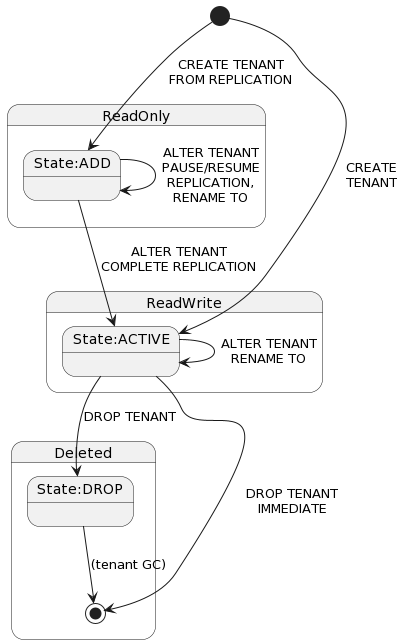
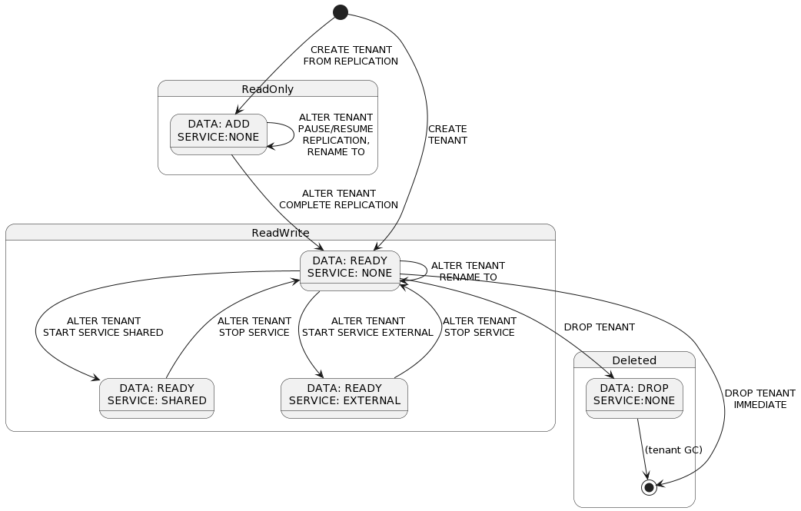
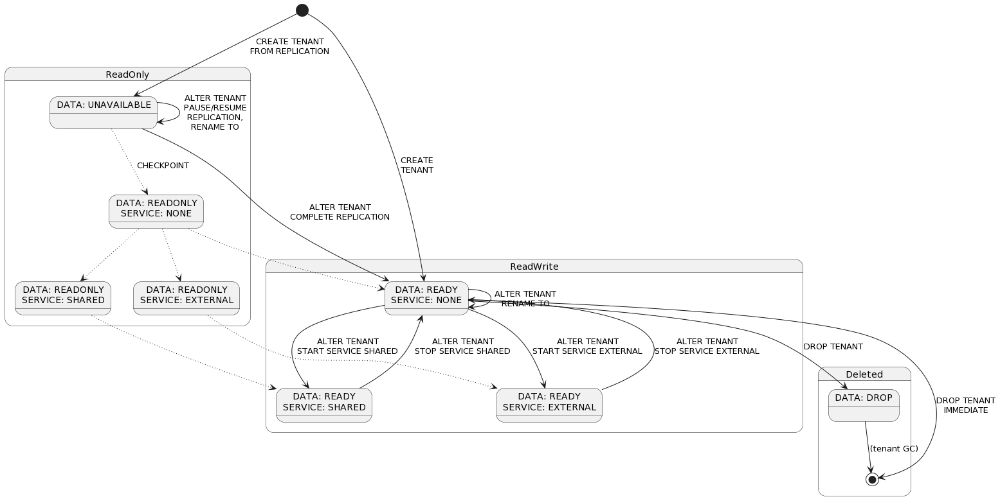

- Feature Name: Tenant orchestration in v23.1
- Status: completed
- Start Date: 2023-01-18
- Authors: knz ajw dt ssd
- RFC PR: [#96147](https://github.com/cockroachdb/cockroach/pull/96147)
- Cockroach Issue: [#96146](https://github.com/cockroachdb/cockroach/issues/96146)
  [#83650](https://github.com/cockroachdb/cockroach/issues/83650)
  [#93145](https://github.com/cockroachdb/cockroach/issues/93145)

# Summary

This RFC proposes to clarify the lifecycle of secondary tenants in
v23.1 and introduce a mechanism by which the SQL service for a
secondary tenant can be proactively started on every cluster node
(shared-process multitenancy as used in Unified Architecture/UA
clusters).

The clarification takes the form of a state diagram (see below).

The new mechanism relies on the introduction of a new tenant record
column ServiceMode, that describes the *deployment style* for that
tenant's servers. This can be NONE (no service), EXTERNAL (SQL pods,
as in CC Serverless) or SHARED (shared-process with the KV nodes).
When in state SHARED, the KV nodes auto-start the service.

We also propose to use this mechanism as a mutual exclusion interlock
to prevent SQL pods from starting when the tenants also use
shared-process multitenancy.

The implementation for this change is spread over the following PRs:

- https://github.com/cockroachdb/cockroach/pull/95691
- https://github.com/cockroachdb/cockroach/pull/95658
- https://github.com/cockroachdb/cockroach/pull/96144

# Motivation

Until today, the only requirements we knew of were that:

1. we could not start the SQL service for INACTIVE tenants, whose
   keyspace is read-only and cannot support initialization of the SQL
   service yet.
2. we could not start the SQL service for all ACTIVE secondary tenants
   inside a regular KV node, because there may be thousands of those in
   CC serverless.

The implementation as of this writing is that of a "server controller"
able to instantiate the service for a tenant **upon first use** (triggered
by a client connection), and only if that tenant is ACTIVE.

Unfortunately, this simplistic view failed to provide answers to many
operational questions. These questions include, but are not limited
to:

- what if there are 3 nodes, and a client only opens a SQL session on
  the first node. How can we *distribute queries* to all 3 nodes? At
  that point the SQL service is only running on 1 node and unable to
  run DistSQL on the other 2.
- what if a cluster is idle (no SQL connection) but there are
  scheduled jobs to run?
- which tenants should be woken up to serve a UI login request when a
  user hits the DB console the first time?

Generally, there is appetite for some form of mechanism that
**proactively starts the SQL service on all nodes.**

Additionally, we have two additional concerns:

- the way the SQL instances table is managed currently precludes
  serving a tenant simultaneously using shared-process multitenancy
  and using separate SQL pods, lest RPC communication becomes
  incorrect. We would like some guardrails to prevent this mixed
  deployment style.
- we would like to prevent the SQL service from starting
  when the tenant keyspace is not ready, e.g. during replication.

# Technical design

The proposal is to evolve the current tenant record state diagram,
from this (Current state diagram as of 2022-01-17):

([diagram source](https://www.plantuml.com/plantuml/uml/TP6nIWGn48RxFCMmbOg7_HLo8JDAOBDPiZajF8l0fX3M57Un4F7TdJEOow5sEpFVz_-GtHnosEUtrqNmHuxWOfXjMjxXGm2KbKI4S81kEavhdZhnsT2F-vSSMrnv_K2DKHOd2UCISvmR1PqT6-4uTWBAUhMwXQUhPrZ3HOuff0ptwbB0Jqqz5zhJ80U_IzeOGYqzSIkVlp69o9XonEiAtZbhmD7OQoMzjaEbItuLTgaOWbFExxBtv6gUicRioLERUN8GVmcZt4vqusZQ6Yvfh6kUc344tehIzd_ntsnvaxEd4PkOPlxTNm00))

(3 states: ADD, ACTIVE, DROP. ADD is used during streaming replication.)

To the following new state diagram:

([diagram source](https://www.plantuml.com/plantuml/uml/bPDTI_im5CRlyoaEk_h_nU7zBcIXEMgXRKgQ-OBp8jY0WngbY-8Glxk7PeaTHOPNsPhdzppdfLrklUdzstF7w8UteAnffUjsyCa0mgEPu9elW0knTWsgwpp3HIKhd87PmiQPHxzvj-nhP73JRxoTEYZaukx70v99JypkcBgvuWh5eDy-cTwsnm2yrQWgNWo8_V2sTwPZ4D9WFZ_V-m3rLf0KD5QyqkIWkTAmzzddCeXg0eC5SHDGrf4R1wNq8r6nOWQ9-7DSqa-o59qbWfPfLy9srjjskYcXP3rTDhJzook3uHXoxayUAEMVjyuu3vVP_rX5kWrMgOIyB57aN2ELGDU3BBv1fCqKqbrINoXPWiAwo3EkSrab96H4_Te5W2MdtsUGoR8kKEFOzf2BVoPepLSDdYbiLYL5ZlZJyMXJ-s5A1_spfNKjVMhV))

In prose:
- We split the tenant "state" into two fields:
  - DATA (`DataState`) indicates the readiness of the logical
    keyspace: ADD, READY, DROP.
  - SERVICE (`ServiceMode`) indicates whether there's a service
    running doing processing for that tenant: NONE (no server
    possible), SHARED (shared-process multitenancy) and EXTERNAL
    (separate-process multitenancy)
- New SQL syntax ALTER TENANT START/STOP SERVICE SHARED/EXTERNAL to switch the SERVICE.
- Each KV node is responsible to wake up the SQL service for all
  tenant records in the SERVICE:SHARED state. (This will be done
  initially via a refresh loop, and can be enhanced to become more
  precise via a watcher or a fan-out RPC.)
  - We would remove the code that auto-starts
    a service upon first connection. Instead, an attempt to connect to
    a service that is not yet started would fail.
- Each KV node is also responsible for shutting down SQL services that
  are currently running for a tenant that is in the SERVICE:NONE
  state.
- When *Not* in SERVICE:NONE state (i.e. either SHARED or
  EXTERNAL), tenants cannot be renamed (at least not in
  v23.1 - this is discussed further in the appendix at the end).
- The `mt start-sql` command (start standalone SQL pod, used in CC
  Serverless) would refuse to start a SQL service for a tenant whose
  record is not in state SERVICE:EXTERNAL, because at this stage we do
  not support running mixed-style deployments (with both
  separate-process and shared-process SQL services) - this solves
  [this issue](https://github.com/cockroachdb/cockroach/issues/93145).
- The SQL service would always refuse to start when the data state is
  not READY (cf [this
  issue](https://github.com/cockroachdb/cockroach/issues/83650)), and
  when the service mode does not match the requested deployment.

Once we have this mechanism in place:
- UI console login uses SERVICE:SHARED tenants for multi-login. No
  question remains "which tenants to log into".

We also take the opportunity to restructure the `system.tenants`
table, to store the data state and service mode as separate SQL
columns.

## Drawbacks

None known.

## Rationale and Alternatives

The main alternative considered was to not rely on a separate service mode column.
Instead:

- A new cluster setting `tenancy.shared_process.auto_start.enabled`,
  which, when set (it would be set for UA clusters) automatically
  starts the SQL service for all tenants in state ACTIVE.
- Like in the main proposal, we would not need to (and would remove)
  the code that auto-starts a service upon first connection. Instead,
  an attempt to connect to a service that is not yet started would
  fail.
- Server controller would also auto-shutdown tenant records that go to
  state DROP or get deleted.
- DB console served from KV node / server controller would select
  tenants for auto-login as follows: if
  `tenancy.shared_process.auto_start.enabled`is set, all ACTIVE
  tenants otherwise, only `system`.

This alternate design does not allow us to serve some tenants using
separate processes, and some other tenants using shared-process
multitenancy, inside the same cluster. We are interested in this use
case for SRE access control in CC Serverless (e.g. using a secondary
tenant with limited privileges to manage the cluster, where SREs would
connect to)

We have also considered the following alternatives:

- a cluster setting that controls which tenants to wake up on every node.

  We disliked the cluster setting because it does not offer us clear
  controls about what happens on the "in" and "out" path of the state
  change.

- a constraint that max 1 SQL service for a secondary tenant can run at a time.

  This makes certain use cases / test cases difficult.

- the absence of any constraint on the max number of SQL service per node.

  We dislike this because it's too easy for folk to make mistakes and
  get confused about which tenants have running SQL services. We also
  dislike this because it will make it too easy for customers eager to
  use multi-tenancy to (ab)use the mechanisms.

- a single fixed tenant record (with a fixed ID or a fixed name) that
  would be considered as "the" resident tenant, and have servers only
  start SQL for that one tenant.

  We dislike this because it will make flexible scripting of C2C replication more difficult.

## Summary table

| | Main approach: separate SERVICE and DATA states | Approach 2: no separate RESIDENT state, new cluster setting auto_activate |
|--|--|--|
| When does the SQL service start? | When record enters SERVICE:SHARED state. Or on node startup for tenants already in SERVICE:SHARED state. | When record enters ACTIVE state and auto_activate is true. Or on node startup for tenants already in ACTIVE state. |
| When does the SQL service stop? | When tenant record leaves SERVICE:SHARED state. Or on node shutdown. | When record gets dropped or deleted. Or on node shutdown. |
| Steps during C2C replication failover. | ALTER TENANT COMPLETE REPLICATION + ALTER TENANT START SERVICE SHARED  | ALTER TENANT COMPLETE REPLICATION |
| Which tenants to consider for UI login? | All tenants in SERVICE:SHARED state. | If auto_activate is true, all tenants in ACTIVE state. Otherwise, only system tenant. |
| Ability to run some tenants using shared-process multitenancy in CC Serverless host clusters, alongside to Serverless fleet, for access control for SREs. | Yes | No |
| Control on number of SQL services separate from tenant activation? | Yes | No |

# Explain it to folk outside of your team

The explanation here is largely unchanged from the previous stories we
have told about v23.1.

The main change is that a user would need to run `ALTER TENANT ...
START SERVICE SHARED/EXTERNAL` before they can start the SQL service and
connect their SQL clients to it.

# Unresolved questions

N/A

# Appendix

## About tenant renames

Why we may not support renaming tenants while they have SQL services running.

There are at least the following problems:
- SQL client traffic. We want clients to route their traffic by name.
  If we rename while service is active, clients suddenly see their
  conns going to a different cluster. That seems like undesirable UX.
- Tenant names in UI login cookies
  - Here the problem is that if a tenant is renamed the cookie is invalid.
  - Also if another tenants get renamed to a name that was held by
    another tenant previously, the browsers will sent cookies for that
    name to it.
  - Possible solution: hash the tenant ID in the cookie? Or something
  - We don't know if we can do this improvement in v23.1, so the
    conservative approach is to prevent renames in that state.
- Tenant names in metrics
  - for metrics, we observe a service not a name, if the tenant gets
    renamed while the service is still running the metrics being
    observed should still be that of the original service.
  - David T disagrees.
  - We don't know what the resolution should be, so the conservative
    approach is to prevent renames in that state until we know what we
    want.

## Possible future extension

In the future, we may want to support serving SQL for a tenant keyspace
in a read-only state.

([diagram source](https://www.plantuml.com/plantuml/uml/ZPJ1ZjCm48RlVehHdW1HSUy1hKa6DYAn8yTTGBizHCGIbOAB4eEeAjwTKHoDwgPRzPHqvl_c7q_6lHz3EuJVFtj1By61SMsdVN-0em28eRjSMhc6ZPAFiYZbXnBle1rXvzllOVV7dUiCobohyjkpRz0y5XckGMaLcM5_Wng_MZHAbZDnYq7p80tcCp0A0TmTh9wwVGYkswxUKmxMa3rWzhdMXR8aeqWgS9U2e_XtCfulmuxUZfVQkdneOWvNrUa9nX_juBehm79AxczmWszx0T4DLjHth4CdbYL9mQAIob85Aus5kSxiIzoi9Z2M86u1wdh9iHytSTsH6nV0n6skASk-3AQSeMU5O3L_kzprBhXk-ULoe-jfZDsm_oLWUaoLdzvigUwhu7ph0tpANhClPoUOJOkgmhoG5icKqfECDv5Mpo3bMFtHw0eCrcMHILjenSZamVfd7m71bLu-TQQhkaIBITc4un_dQ2qt3Rups6mgiZpXtvuECxqRiGiAkYJAwqXN9qdCgyqpZADEXYZkdU_e_-W_))
